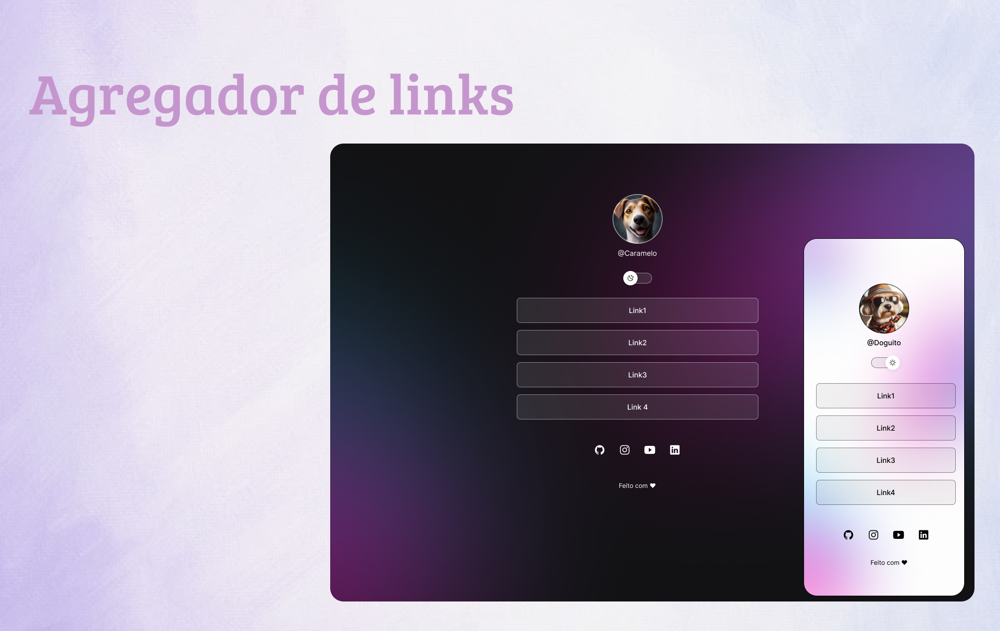

<h1 align="center"> Agregador de links </h1>

Após meses estudando lógica de programação em pseudocódigo, desde fundamentos até conceitos complexos, estou pronta para uma nova fase na minha carreira como desenvolvedora. Esta nova jornada será desafiadora, mas acredito que minha preparação me capacitará para o que está por vir.

  

## ✏️ Aprendizado

Como primeiro contato com todas as tecnologias aplicadas, sinto que finalizo este projeto sendo uma pessoa diferente, com pensamentos mais analíticos e com muita bagagem para aplicar em outros conceitos. Deixo aqui meu agradecimento à Rocketseat pelo Discover e ao instrutor Mayk Brito pela capacidade de ensinar conceitos complexos de uma forma tão simples.

## 🚀 Tecnologias

Esse projeto foi desenvolvido com as seguintes tecnologias:

- HTML e CSS
- JavaScript
- Git e Github
- Figma

## 💻 Projeto

Um agregador de links para usar como cartão de visitas online.

## 📜Licença

Esse projeto está sob a licença MIT.
